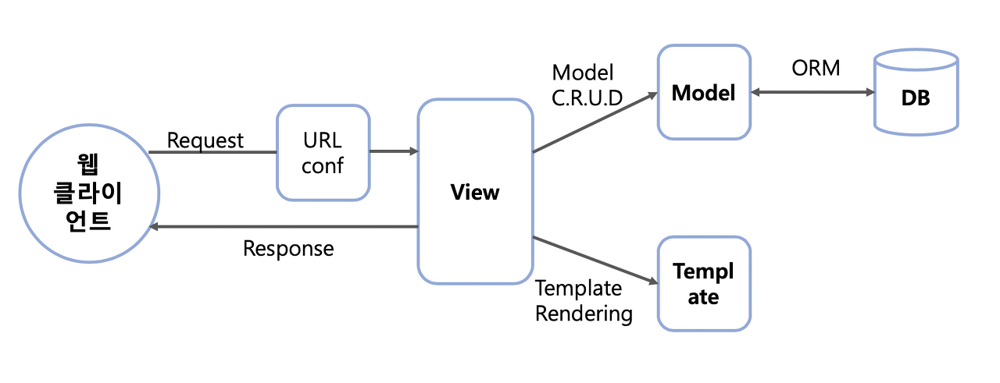

# 프레임워크와 라이브러리
프로그래밍을 할 때 프레임워크와 라이브러리라는 단어를 자주 들어보셨을거라 생각합니다.  
프레임워크와 라이브러리의 개념을 알아보며, 예시를 통해 비교해보도록 하겠습니다.  
___
# Framework

```
소프트웨어의 특정 문제*를 해결하기 위해서 상호 협력하는 클래스와 인터페이스의 집합
(*객체 지향 개발을 하게 되면서 통합성, 일관성의 부족이 발생되는 문제)
```
프레임워크는 뼈대나 기반구조를 뜻하며 프로그래밍을 진행할 때 필수적인 코드, 알고리즘, 암호화, 데이터베이스 연동 등과 같은 기능들을 제공하는 인터페이스의 집합입니다. 때문에 프레임워크를 사용하는 프로그래머는 이 프레임워크의 뼈대 위에서 코드를 작성하여 프로그램을 개발하게 됩니다. 즉, 프레임워크는 완성된 제품이 아닌 완성된 제품을 만들기 위해서 개발자를 도와주는 또는 기반이 되는 역할을 합니다.  
<br></br>
* **언어별 대표 프레임워크**  

|프로그래밍 언어|프레임워크|
|:---:|:---:|
|Python|Django, Flask|
|Java|Spring, Struts|
|JavaScript|React, AngularJS|
|PHP|Laravel, Symphony, Symphony|

<br></br>
* **Django로 프레임워크와 친해지기!**
<br></br>
>Django는 Python 기반의 무료 오픈소스 웹 애플리케이션 프레임워크입니다.  
>웹사이트는 기본적으로 사용자 인증(회원가입, 로그인, 로그아웃)이나 웹사이트의 관리자 패널, 폼, 파일 업로드와 같은 비슷한 요소들을 필요로 합니다.  
>장고는 이러한 요소들을 신속하게 개발하는데 도움을 주는 구성요소로 이루어져 있어, 개발자는 웹 개발에서 번거로운 요소들을 새로 개발할 필요 없이 내장된 기능만을 이용해 빠른 개발을 할 수 있습니다.
>
><p align="center"></p>
>
> **Django의 MVT 패턴**
>
>장고는 `Model`, `View`, `Template`의 앞 글자를 딴 MVT 아키텍쳐를 기반으로 합니다.
>`모델`은 데이터 베이스에 저장되는 데이터의 저장,수정,변경 등을 기능을, `템플릿`은 사용자에게 보여지는 UI부분을, `뷰`는 실질적으로 프로그램 로직이 동작하여 데이터를 가져오고 적절하게 처리한 결과를 템플릿에 전달하는 역할을 수행합니다.
<br></br>
___
# Library
```
프로그램 기능 수행을 위해 활용 가능한 도구들의 집합
```
라이브러리는 프로그래머가 개발하는 데 필요한 특정 기능에 대한 API(도구/함수)를 모은 집합입니다.  
개발자가 만든 클래스에서 호출하여 사용, 클래스들의 나열로 필요한 클래스를 불러서 사용하는 방식을 취하고 있습니다.  
<br></br>
* **언어별 라이브러리 예시**  

|프로그래밍 언어|라이브러리|
|:---:|:---:|
|Python|Libcloud, Arrow, Behold|  
|Java|JUnit, Jackson|
|avaScript|jQuery, Chart.js| 

<br><br/>
* **Tensorflow로 라이브러리와 친해지기!**

<br></br>
참고자료 [프레임워크와 라이브러리의 차이점](https://webclub.tistory.com/458)
